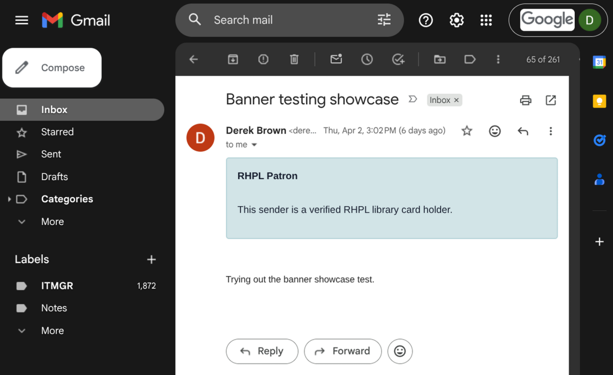
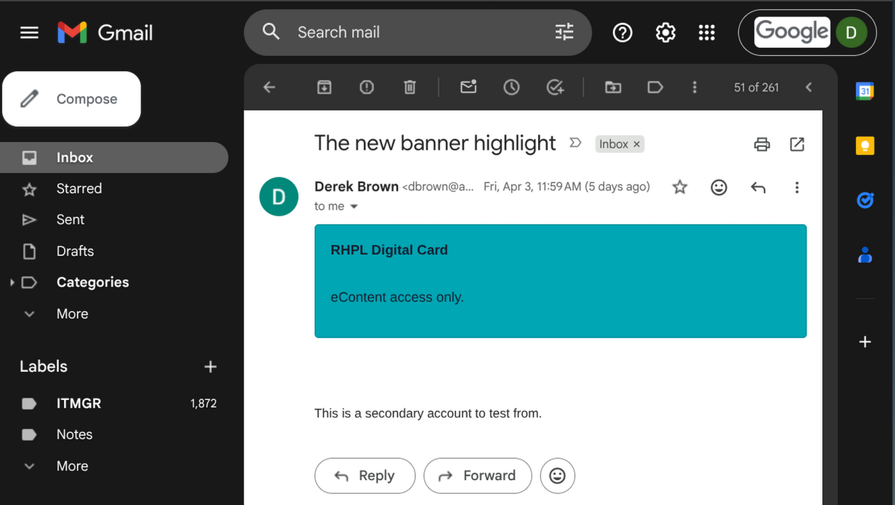
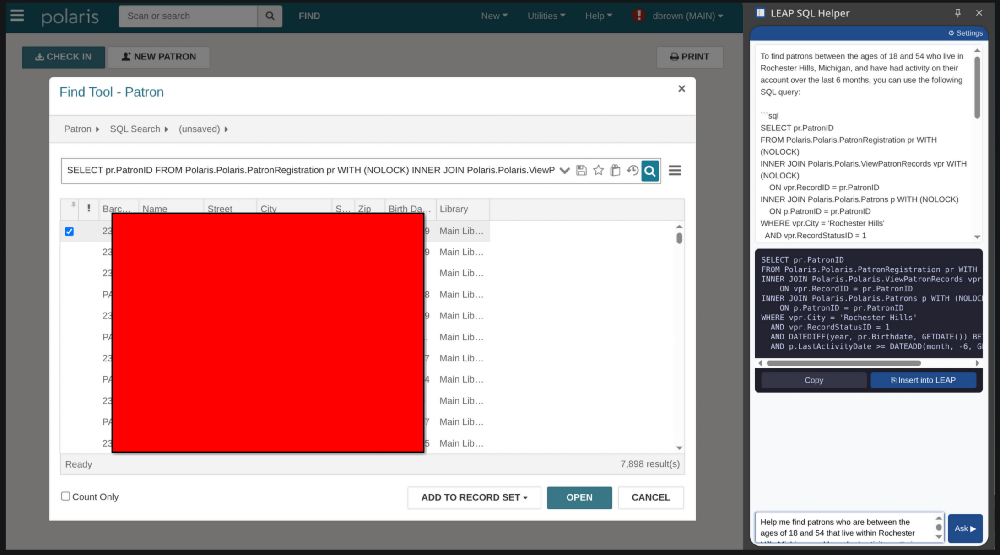

# Sublime Security Integration with Polaris ILS

A nightly pipeline that syncs patron email addresses from **Polaris ILS** to
**Sublime Security**, powering three targeted Gmail warning banners. Staff see
at a glance whether a patron emailing them has a full library card, a digital/e-card,
or a limited/restricted account — without opening LEAP.

Implemented and open-sourced by **[Rochester Hills Public Library](https://www.rhpl.org)**
(Rochester Hills, MI). Shared to help other Polaris libraries implement the same workflow.

---

## What staff see in Gmail

When a patron emails a staff member, one of three banners appears automatically:

**Full / Verified Cardholder**



**Digital / E-Card Only**



**Limited / Restricted Card**



No banner = sender is not a known patron (or is a staff member).

---

## Architecture

```
11:00 PM  SSRS (SQL Server Reporting Services)
           3 report subscriptions fire nightly
           → each queries Polaris by patron card type
           → renders as CSV
           → emails attachment to sync mailbox (e.g. sublime-sync@yourlibrary.org)

11:30 PM  polaris_to_sublime_sync.py  (Linux server, systemd timer)
           → connects to sync mailbox via IMAP
           → extracts CSV from each report email
           → deduplicates across tiers (Full > Digital > Limited)
           → PATCHes each list in Sublime Security API
           → deletes processed emails from inbox

           Sublime Security
           → 3 custom lists updated with patron emails
           → 3 MQL detection rules check sender against lists
           → matching rule triggers a Warning Banner in Gmail
```

---

## Why SSRS email? (Important context for Clarivate-hosted libraries)

If your Polaris is **Clarivate-hosted**, your SQL Server runs in Clarivate's
isolated network — completely separate from your library network. Direct database
access from an external Linux server is not possible.

| Approach | Why it fails on Clarivate-hosted Polaris |
|----------|------------------------------------------|
| Direct SQL from Linux (pyodbc) | Port 1433 blocked; Clarivate and library networks are fully separate |
| PAPI bulk patron search | PAPI only supports individual patron lookups — no bulk export endpoint |
| SQL Server Agent → Sublime API | SQL server has no outbound internet access (DNS resolution fails) |
| File share (SMB) | Different networks; no shared path available |
| **SSRS email subscription** | **Works — SSRS runs server-side and delivers email through SMTP regardless of network** |

SSRS email subscriptions are the only automated bridge out of Clarivate's
environment. This approach also works fine for self-hosted Polaris.

---

## Patron Tiers

| Sublime list | Banner | Patron card type | Priority |
|-------------|--------|-----------------|---------|
| `patron_emails_full` | Verified Patron | Full-privilege card (checkout, holds, rooms, events) | 1 (highest) |
| `patron_emails_digital` | E-Card / Digital Card | eContent access only | 2 |
| `patron_emails_limited` | Restricted Card | Limited card type (restricted holds, rooms, or events) | 3 |
| *(excluded)* | *(no banner)* | Staff-only card types | — |

**Priority rule:** If a patron holds accounts under multiple card types, their
email appears in the highest-priority list only. This ensures only one banner
fires per sender.

Card types are defined by `PatronCodeID` in Polaris. Every library's codes are
different — see [ssrs/discover-patron-codes.sql](ssrs/discover-patron-codes.sql)
to identify yours.

---

## Prerequisites

- **Polaris ILS** (Clarivate-hosted or self-hosted) with SSRS access
- **Sublime Security** account (any tier that supports custom lists and detection rules)
- **Google Workspace** (Gmail) — staff accounts receiving patron email
- **A dedicated Gmail service account** to receive SSRS CSVs (e.g. `sublime-sync@yourlibrary.org`)
- **A Linux server** (any distro) with Python 3.8+, outbound HTTPS, and `systemd`

---

## Quick Start

Follow the sections in order:

1. **[ssrs/README.md](ssrs/README.md)** — Identify your PatronCode IDs, create three SSRS reports,
   configure nightly email subscriptions
2. **[sync/README-setup.md](sync/README-setup.md)** — Deploy the script, configure `.env`, test manually
3. **[systemd/README.md](systemd/README.md)** — Schedule the script with a systemd user timer
4. **[sublime/README.md](sublime/README.md)** — Create lists, detection rules, and automations in
   the Sublime dashboard

---

## Sync script at a glance

[`sync/polaris_to_sublime_sync.py`](sync/polaris_to_sublime_sync.py)

- Reads Gmail via IMAP — no polling service required
- Matches emails by subject line (configurable in `.env`)
- Parses and normalizes all email addresses (lowercase, trimmed)
- Filters out staff addresses by domain
- Applies cross-list priority deduplication before pushing
- Full list overwrite via `PATCH /v1/lists/{id}` — always consistent
- Rotating log file, 5 MB max

---

## Adapting to your library

The RHPL-specific values you need to change:

| Location | RHPL value | Replace with |
|----------|-----------|-------------|
| All SQL files | `PatronCodeID IN (...)` | Your library's code IDs (from `discover-patron-codes.sql`) |
| All SQL files | `NOT LIKE '%@rhpl.org'` | Your staff email domain |
| `.env` | `STAFF_EMAIL_DOMAIN=rhpl.org` | Your staff email domain |
| `.env` | `GMAIL_ADDRESS=sublime-sync@rhpl.org` | Your sync mailbox |
| `.env` | `SUBLIME_BASE_URL` | Your Sublime regional URL (shown next to your API key) |
| systemd service | `/opt/sublime-sync/` | Your deploy path |

Everything else (list names, subject lines, script logic) works as-is — or can be
customized via `.env` without touching the script.

---

## Future: LEAP URL Integration

RHPL has submitted a feature request to Sublime Security to support **URL payloads
in banner actions**. If implemented, this would allow the warning banner to include
a direct link that opens the patron's LEAP record — so staff could click through
from Gmail to LEAP without a separate search.

This would require:
- The SSRS queries to include `PatronID` alongside `EmailAddress`
- The sync script to build and store a LEAP URL per patron
  (e.g. `https://leap.yourlibrary.org/polaris/leap/patrons/{PatronID}`)
- Sublime to support a clickable URL field in the Warning Banner action

We'll update this repo when the feature is available. Libraries interested in this
enhancement are encouraged to submit the same request to Sublime Security support.

---

## Security notes

- **Patron email addresses are considered PII.** The Sublime lists are private to
  your Sublime organization and accessible only via API key or dashboard login.
- **`.env` is excluded from git** via `.gitignore`. Never commit it.
- **A compromised patron email account** sending phishing will be marked Benign by
  the patron automation. Sublime's NLU, link-analysis, and attachment-analysis
  enrichment functions in the MQL rules can mitigate this for high-risk mail.
  See `sublime/automation-patron-benign.md` for details.

---

## License

MIT — use and adapt freely. Attribution appreciated but not required.
